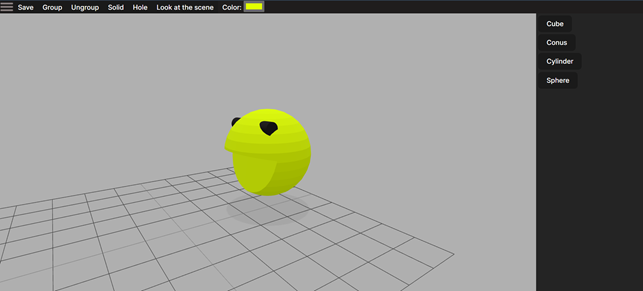

## Description
Editor for creating 3D models using [Constructive Solid Geometry](https://en.wikipedia.org/wiki/Constructive_solid_geometry).

### [In action (video)](https://drive.google.com/file/d/1EaGC0rgZM78isa7YWTGCszfiDUjDTR0y/view?usp=sharing)

## Applications
/backend — application backend.

/frontend — application frontend.

/shared — application common modules for reuse.

## Technologies
### Frontend
* React 18
* Vite
* Three.js

### Backend
* Node.js 18
* Express
* Sequelize ORM
* PostgreSQL
